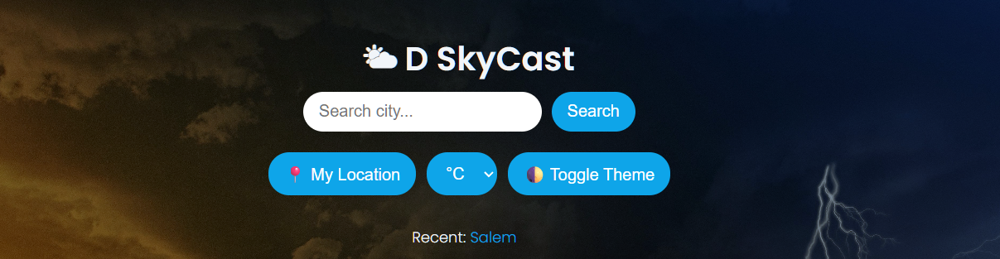
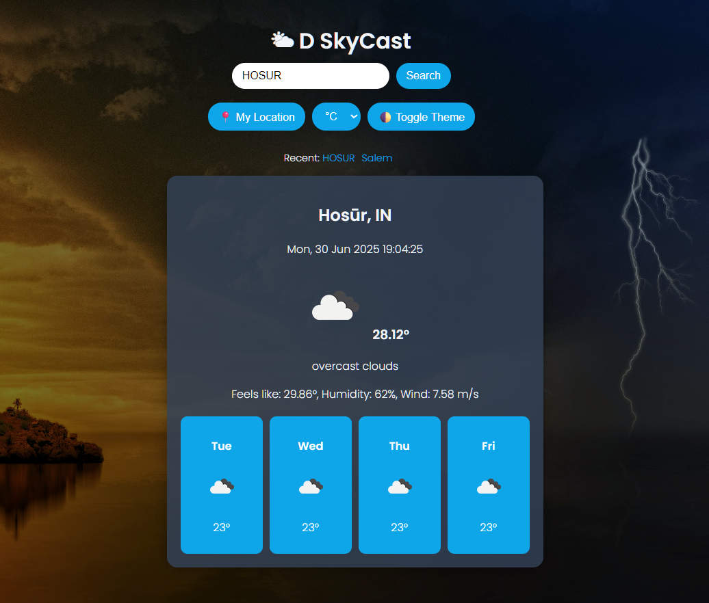
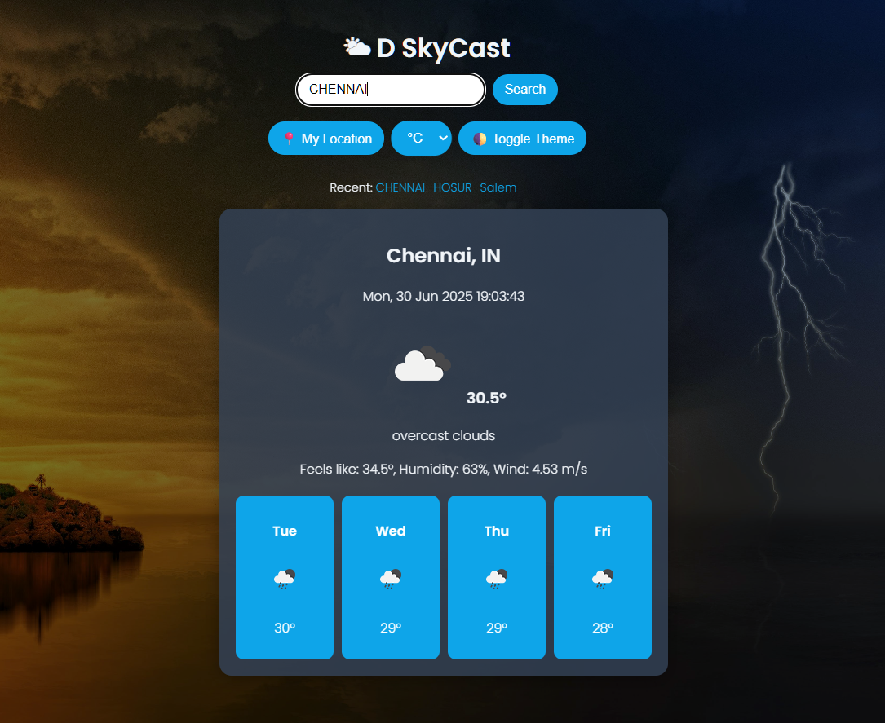

# 🌦️ Weather Project

A responsive and user-friendly weather application that allows users to search for real-time weather updates by city. Built with **HTML, CSS, and JavaScript**, this project fetches live data from a weather API and displays it in a clean, modern interface.

---

## 🚀 Live Demo

🔗 [View Live Demo](https://dharsh606.github.io/weather-project/)  

---

## 📸 Screenshots

### Homepage


### Search Result




---

## ✨ Features

- 🌍 Search weather by city name  
- 🌡️ Displays temperature, humidity, and weather conditions  
- 📱 Fully responsive design for desktop and mobile  
- 🔄 Real-time weather updates using a weather API  

---

## 🛠️ Technologies Used

- **Frontend:** HTML, CSS, JavaScript  
- **API:** [OpenWeatherMap API](https://openweathermap.org/api) (or whichever API you used)  

---

## ⚙️ Installation

1. Clone the repository  
   ```bash

   
   git clone https://github.com/Dharsh606/weather-project.git
   cd weather-project


   
## 👤 Author

Made with ❤️ by **Dharshan V**  
🔗 [Connect with me on LinkedIn](https://www.linkedin.com/in/dharshanvreddy/)

---

## 📜 LICENSE (MIT)

```text
MIT License

Copyright (c) 2025 <DHARSHAN V REDDY>

Permission is hereby granted, free of charge, to any person obtaining a copy
of this software and associated documentation files (the “Software”), to deal
in the Software without restriction, including without limitation the rights
to use, copy, modify, merge, publish, distribute, sublicense, and/or sell
copies of the Software, and to permit persons to whom the Software is
furnished to do so, subject to the following conditions:

The above copyright notice and this permission notice shall be included in
all copies or substantial portions of the Software.

THE SOFTWARE IS PROVIDED “AS IS”, WITHOUT WARRANTY OF ANY KIND, EXPRESS OR
IMPLIED, INCLUDING BUT NOT LIMITED TO THE WARRANTIES OF MERCHANTABILITY,
FITNESS FOR A PARTICULAR PURPOSE AND NONINFRINGEMENT. IN NO EVENT SHALL THE
AUTHORS OR COPYRIGHT HOLDERS BE LIABLE FOR ANY CLAIM, DAMAGES OR OTHER
LIABILITY, WHETHER IN AN ACTION OF CONTRACT, TORT OR OTHERWISE, ARISING FROM,
OUT OF OR IN CONNECTION WITH THE SOFTWARE OR THE USE OR OTHER DEALINGS IN
THE SOFTWARE.
    
